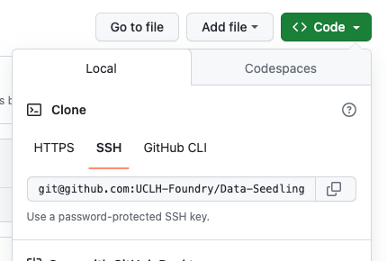
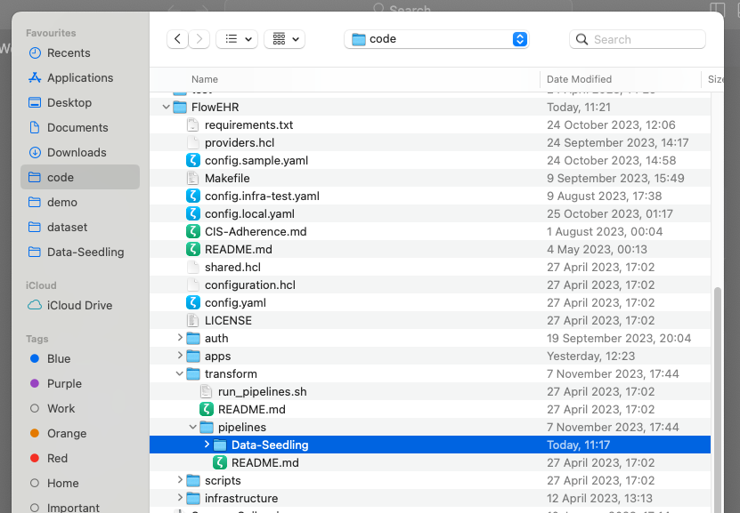
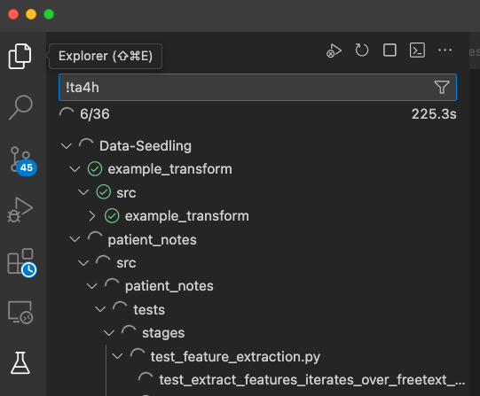
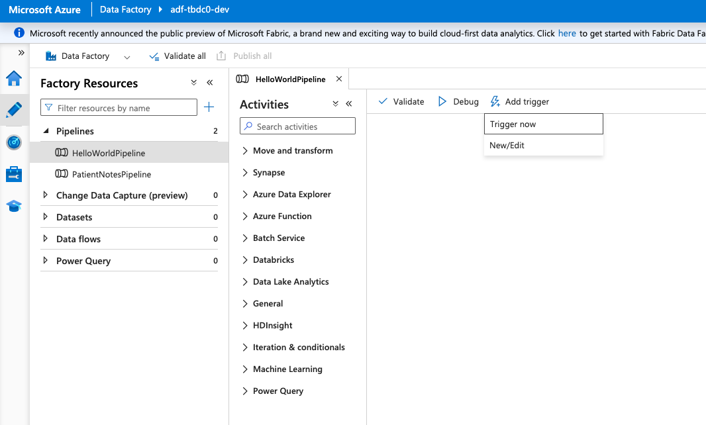

# Quick Start

This repository is designed to work with an instance of FlowEHR. To work with Data Pipelines in FlowEHR, you will need to have both FlowEHR repo and the Data Seedling repo opened in VSCode. This document describes the way to set them up, and test your changes in your personal development deployment.

1. Clone [FlowEHR repo](https://github.com/UCLH-Foundry/FlowEHR) and deploy an instance of FlowEHR following the [steps outlined in the README](https://github.com/UCLH-Foundry/FlowEHR#getting-started).
Note that the resource group in which almost all resources will be created will have name that looks like `rg-${flowehr_id}-dev`, e.g. `rg-myflwr-dev`.

2. Create a new repository using this template, as shown on the screenshot. Pick a name for your data pipeline repository. Do not clone the repository yet.

3. In `config.transform.yaml` add the following lines to make FlowEHR work with your new repo. Replace the link to the repo with the one pointing at the repository you created in the previous step. Note that you will need a SSH URL.



Now, add this link to the `repositories` section of the `config.local.yaml` in FlowEHR repo:

```
transform:
  repositories:
   - git@github.com:<YOUR_GITHUB_ORG>/<YOUR_PIPELINE_REPO_NAME>.git
```

4. Re-run `make all` in your FlowEHR devcontainer that you have created on step 1. You should see Terraform creating cloud resources for your pipeline.


5. Once that's done, you will be able to see your pipelines created in the Azure Data Factory instance in Azure Portal. Head to [portal.azure.com](portal.azure.com), find your resource group you created on step 1, and find an instance of Azure Data Factory there. It should have a name like `adf-<flowehr_id>-dev`.

Press `Launch Studio`, click on the Edit icon on the left, and you should see your pipelines created in Data Factory:


6. Now you can open the pipeline repository and start making changes in it. Note that as part of the deployment, FlowEHR checks out the repositories for you (this is why you provided the repository). So you can now open that cloned repo in your VSCode.

First, open a new window in VSCode and press `Open...`.

Now, head to where you checked out the FlowEHR repo on step 1. In that directory, navigate to `transform`, `pipelines`, and finally, the name of the repo you created on step 2.



> Note: It's recommended using VSCode for working with FlowEHR and pipelines, as it enables the use of the DevContainers.

7. Reopen that repo in a DevContainer (you will get a prompt, or alternatively click the bottom left green button, then `Reopen in container`). You are now ready to start developing your pipeline code.

8. To run tests locally, use the Testing tab in VSCode. 



9. Once you are ready to deploy your updated code and trigger the pipeline, head to FlowEHR DevContainer and run in terminal:

`make infrastructure-transform`

This will deploy your updated code to Databricks.

Now, you can trigger your updated pipeline. You can do so from the ADF instance. Find your pipeline in the Edit screen, then click `Trigger`, `Trigger now`:



> Note: There is currently a bug in FlowEHR that means the deployed pipeline code might not get updated when you run the above command. Currently, a workaround for this is to either delete the FlowEHR cluster before you re-deploy the pipeline code, or increase the Python wheel version in [pyproject.toml](../example_transform/pyproject.toml) and [pipeline.json](../example_transform/pipeline.json).

10. You will need to change one setting for the metrics to be displayed correctly. Head to the Application Insights resource deployed in your resource group, it should have a name like `transform-ai-${flowehr_id}-dev`. Head to `Usage and estimated costs`, click on `Custom metrics (preview)`, and make sure custom metrics are sent to Azure with dimensions enabled:


11. Now you can check metrics and logs in Application Insights. To check the logs, head to the Application Insights service created in your resource group, as described in step 2. There, head to the `Logs` section. To see logs created by the pipeline, type `traces`. See screenshot: 


To check the metrics dashboard, look for `PatientNotesPipelineStatusDashboard` created in your resource group. See screenshot:


